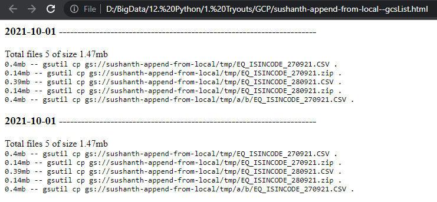
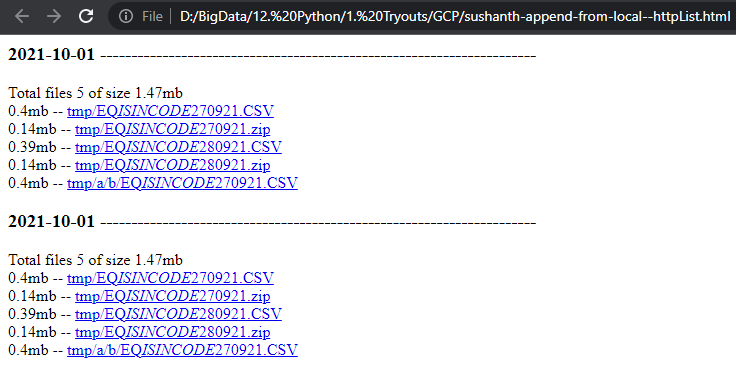

## GCS Upload Tracker

Simple utility to run before uploading any files to GCS to track what files were uploaded and when and also generate a link and gutil command to download it as well. 

#### Requirement
I upload files to GCS regularly but i don't know what i uploaded and when i uploaded it and if i want to download the file, i had to go to cloud storage console and to the specific folder to download it or write a GSUTIL command at that time to download it. 

#### Solution
This utility, i will have to run before uploading the files. It will generate 4 files(2MarkDowns and 2HTMLs). In the HTML GSUTIL file, you will find the GSUTIL command and in the HTTP file you can find the link using which you can directly download the file in Cloud Storage

#### Output
```
>py -m walkPath   
Reading input from walkPath.txt
bucket=sushanth-append-from-local
pattern=*
root=./tmp

All files and sizes
0.4mb           --> tmp/EQ_ISINCODE_270921.CSV    
0.14mb          --> tmp/EQ_ISINCODE_270921.zip    
0.39mb          --> tmp/EQ_ISINCODE_280921.CSV    
0.14mb          --> tmp/EQ_ISINCODE_280921.zip    
0.4mb           --> tmp/a/b/EQ_ISINCODE_270921.CSV
Total files 5 of size 1.47mb

Writing .md files
Converting GSUTIL .md file to markdown
 -Writing GSUTIL html file to markdown
Converting http .md file to markdown
 -Writing htpp html file to markdown
HTML output files generated
* sushanth-append-from-local--gcsList.html
* sushanth-append-from-local--httpList.html

 Now you can issue below GSUTIL command upload files

    gsutil -m cp -r ./tmp gs://sushanth-append-from-local


 After upload completes you can delete the files in folder ./tmp
```



Format of the http link `https://storage.cloud.google.com/<<bucket-name>>/<<path-to-file>>`

